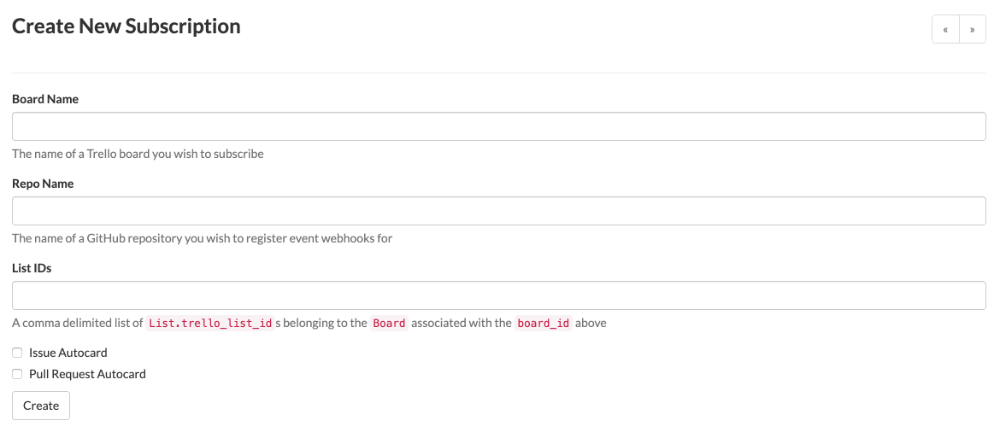
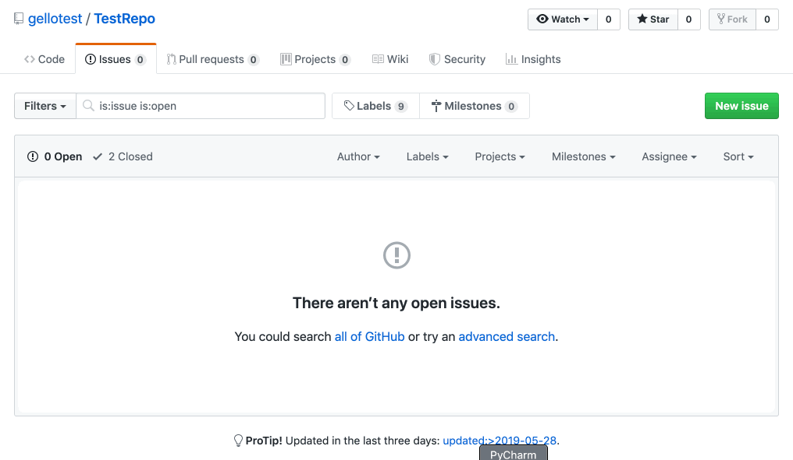

# Gello
_Gello_ is a self-hosted server for managing Trello cards based on GitHub webhook-events.

It is developed by Datadog to help manage community contributions on our open-source GitHub repositories, and incorporate them into our biweekly sprints.

## How it Works

Users can subscribe Trello boards (and lists) to GitHub repositories through a web UI, and Trello cards will be created to the subscribed list following every Issue or Pull Request opened by a community member.
 
### Example Usage:

1. Create a new subscription:

    

2. (A community member) opens an issue:

    

3. View Trello card auto-created from this issue:

    

## Getting Started

1. [Feature Overview](docs/feature.md)
2. [Development Guide](docs/development.md)
3. [Deployment Guide](docs/deployment.md)

## Contributing

> Does something not make sense or work as expected? Please open a [pull request](https://github.com/DataDog/gello/compare) to update this documentation. Thank you!
