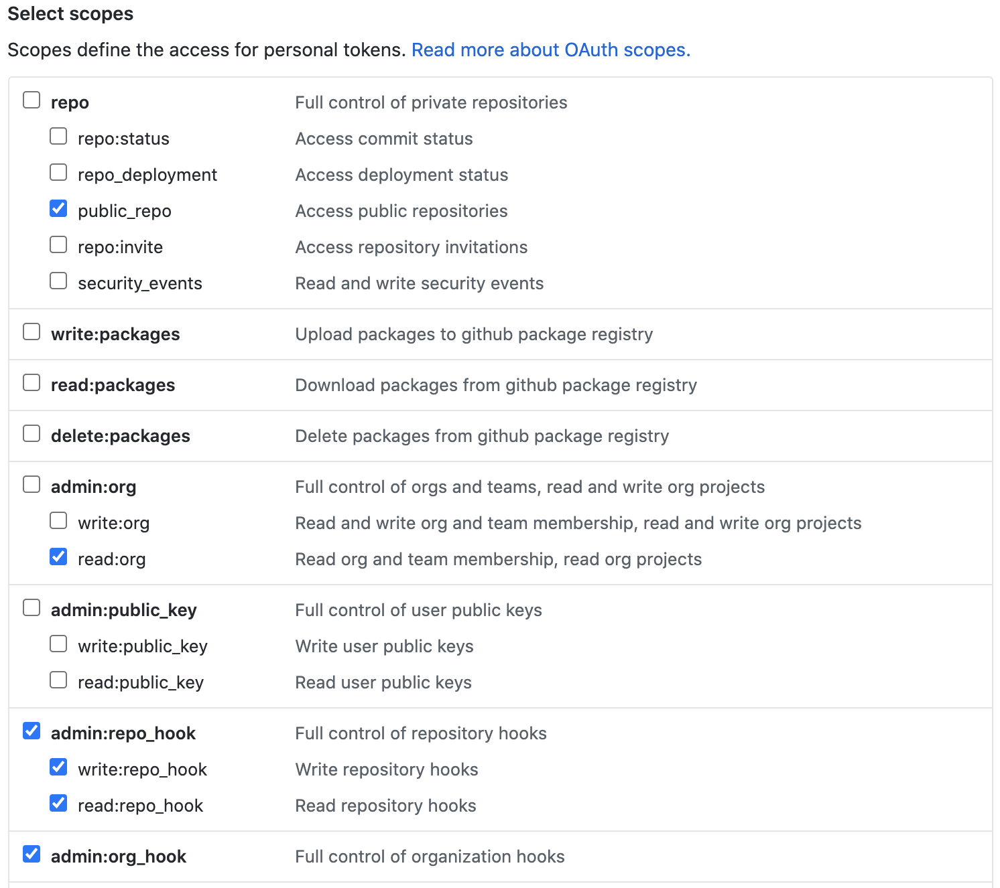

## Configuration

### Configure the Server

_Gello_ requires certain environment variables to be set for the server to be run correctly. Note that at least one of the Trello or JIRA configuation value sections must be correctly filled for _Gello_ to start.

```bash
# Database Credentials
POSTGRES_DB='my_database' # the name of your PostgreSQL Database
POSTGRES_USER='my_user' # the name of your DB user
POSTGRES_PASSWORD='my_password' # The name of your DB password

# Admin user configuration
ADMIN_EMAIL='an_email_account@gmail.com'
ADMIN_PASSWORD='an_admin_password' # create a password for logging into gello

# Database configuration
DATABASE_URL='the_url_for_a_postgresql_database' # likely postgresql://localhost:5432/your_postgresql_database_name
TEST_DATABASE_URL='the_url_for_a_postgresql_database' # Database URL for your test database (used for testing)

# Redis configuration
REDIS_URL='the_url_for_a_redis_client' # defaults to 'redis://localhost:6379/0'

# GitHub configuration values
GITHUB_API_TOKEN='An API token for a user with access to your GitHub organization'
GITHUB_ORG_LOGIN='my-org-example-name' # the name of your organization
GITHUB_ORG_WEBHOOK_ID='123456' # the id of your webhook

# Trello configuration values
TRELLO_API_KEY="A user's public trello API key"
TRELLO_API_TOKEN='An API token generated by the corresponding user'
TRELLO_ORG_NAME='your-org-name' # the name of your trello organization

# JIRA configuration values
JIRA_USERNAME="A user's email address used to log into their JIRA server"
JIRA_API_KEY='A generated API token corresponding to the user'
JIRA_SERVER_ADDRESS='Server address for the JIRA instance' # (including protocol ex. https://gello.atlassian.net)'
```

#### GitHub API Token

The GitHub API token you provide should have the following permissions set:

* `public_repo`
* `read:org`
* `write:repo_hook`
* `admin:org_hook`



#### Trello Configuration

_Gello_ requires two environment variables be set to properly configure the Trello integration.

1. `TRELLO_API_KEY`

This is the key found in the [Trello Developer API Keys page](https://trello.com/app-key):


2. `TRELLO_API_TOKEN`

This is a token generated by from the same [Trello Developer API Keys page](https://trello.com/app-key):


#### JIRA Configurations

_Gello_ requires three environment variables for its JIRA integration.

1. `JIRA_USERNAME`

This is the email address used to log in to JIRA.

2. `JIRA_API_KEY`

This is a user-generated API token found under the [JIRA user API tokens page](https://id.atlassian.com/manage/api-tokens). Follow [these instructions](https://confluence.atlassian.com/cloud/api-tokens-938839638.html) to create a new API token:


3. `JIRA_SERVER_ADDRESS`

This is the server address that API calls will be made to. Remember to include the protocol used (ex. `https://gello.atlassian.net` instead of `gello.atlassian.net`)
