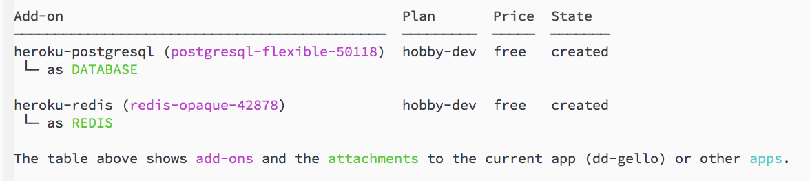

## Deployment to Heroku

1. Login with your heroku credentials

    ```bash
    heroku login
    ```

2. Create your application

    ```bash
    heroku apps:create --buildpack heroku/python
    ```

3. Add redis add-on for celery worker

    ```bash
    heroku addons:create heroku-redis -a your_app_name
    ```

4. Add PostgreSQL add-on for database

    ```bash
    heroku addons:create heroku-postgresql
    ```

5. Verify `REDIS` and `DATABASE` exist

    ```bash
    heroku addons
    ```

    

6. Run the line below for each variable (except `DATABASE_URL` and `REDIS_URL`) in [configuration guide](configuration.md)
    
    ```bash
    heroku config:set VARIABLE_NAME=variable_value
    ```

7. Push the code to heroku
    
    ```bash
    git push heroku master
    ```

8. Start the celery worker on a dyno

    ```bash
    heroku ps:scale worker=1
    ```

9. Open the application

    ```bash
    heroku open
    ```
