## Feature Overview

### Creating a Trello Subscription

When you login to _Gello_, you will be prompted to create a new subscription.

   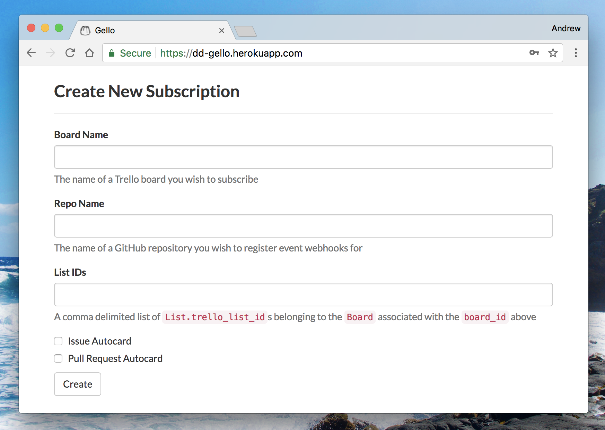

Steps to create a new subscription:

1. Type in the name of the board you wish to create cards to. The input field will autocomplete with values pulled from Trello:

    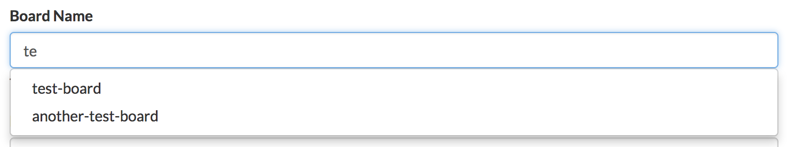

2. Type in the repository name you wish to create cards from. The input field will autocomplete with your organization's public repositories, pulled from GitHub:

    

3. Select if you would like `autocard` functionality for Issues, Pull Requests, or both:

    When creating a new subscription, you are prompted to check if you would like the `autocard` setting for GitHub issues, and GitHub pull requests.

#### Autocard

If `autocard` is checked for issues or pull requests, Trello cards will automatically be created when an issue or pull request is created from a GitHub contributor outside of the organization.

#### Manual

If `autocard` is _not_ checked for issues or pull requests, Trello cards will not automatically be created when an issue or pull request is created by an external contributor. However, a person within the GitHub organization may comment `gello create_card` to create a Trello card for the board lists you have subscribed.

#### Selecting Your Lists

_Gello_ lets you select which lists you would like to create cards to for a subscribed board.

Steps to create a Subscribed List:

1. After creating a _subscription_ between a GitHub repository and a Trello board, click on a link under the "Subscribed Lists" column in the subscriptions table:

    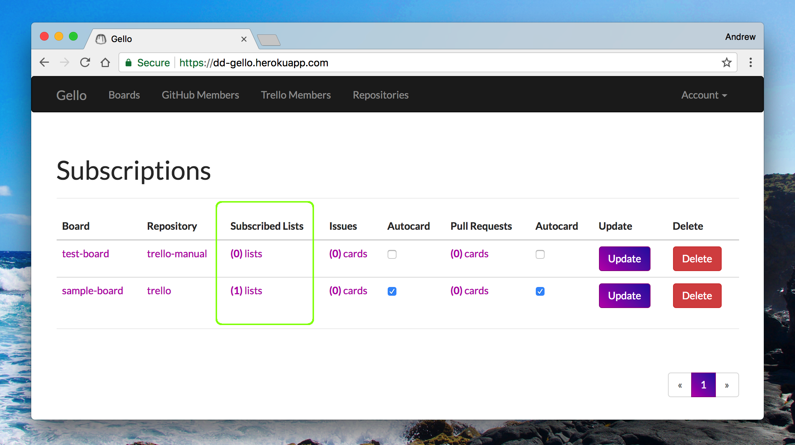

2. Fill out the form to create a subscribed list:

    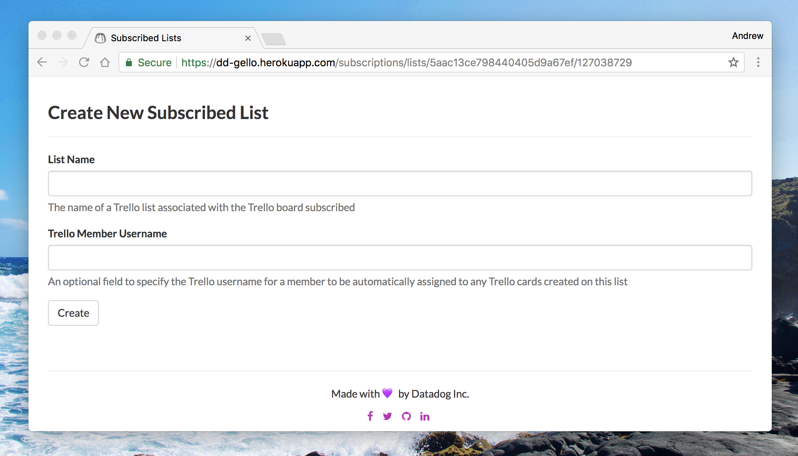

### Creating a JIRA Subscription

Creating a JIRA subscription can be done in a very similar manner to Trello subscriptions. To start, switch over to the Gira view by using the dropdown menu at the left side of the navigation bar:

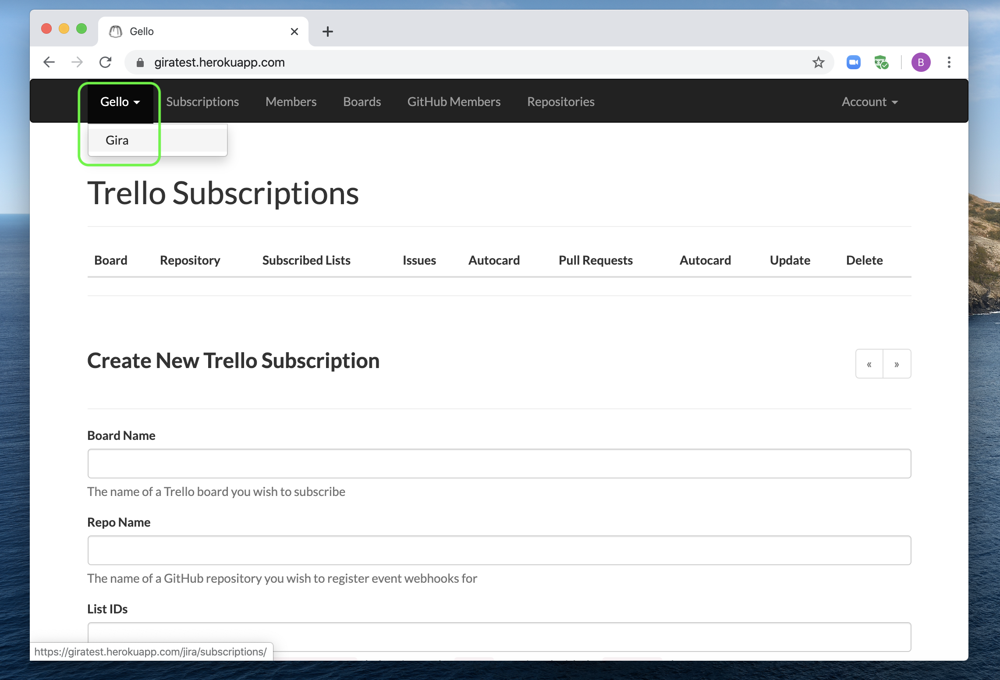

Then fill in the required subscription information:

1. Type in the project that you would like to create issues for. The input field will autocomplete with data pulled from JIRA:

	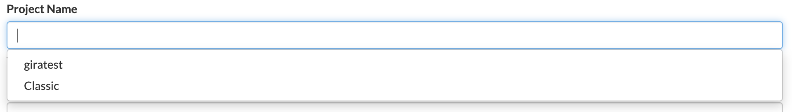

2. Type in the repository name you wish to create cards from. The input field will autocomplete with your organization's public repositories, pulled from GitHub:

    

3. Optionally, issue types can be assigned to all created JIRA issues, and issues can be created as subtasks to pre-existing JIRA issues here. This can also be done after creating the subscription from the subscribed issues screen.

    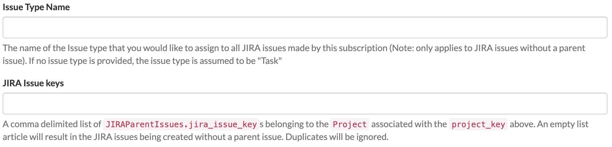

4. Select if you would like `autocard` functionality for Issues, Pull Requests, or both. These settings work as described in the previous section.

#### Selecting Parent Issues and Issue Types

You can opt to choose what type of issue is created by _Gello_, as well as create JIRA issues as subtasks to a pre-existing issue:

1. After creating a _subscription_ between a GitHub repository and a JIRA project, click on a link under the "Subscribed Issues" column in the subscriptions table:

    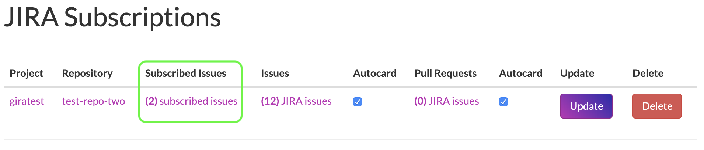

2. Fill out the form to create a new subscribed issue:

    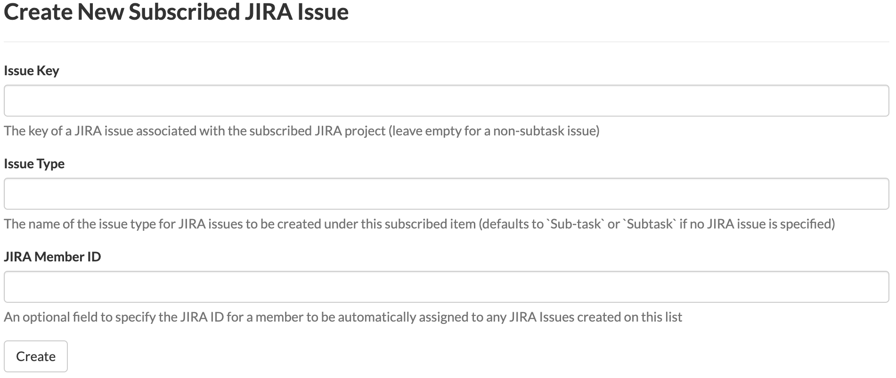

3. You can also manage existing subscribed issues from the same screen:

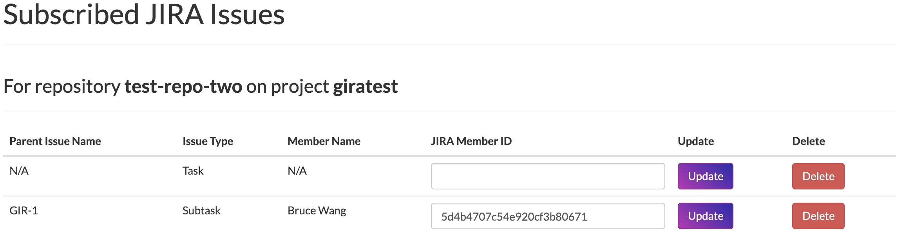

### Aggregating Community Contributions

In addition to creating cards on the lists of Trello boards subscribed, Gello keeps track of open community contributions, which are aggregated by GitHub repository, and can be filtered down by Trello board or JIRA project.

The following steps depict how to view these aggregations for Trello boards. The process for filtering by JIRA project is quite similar, albeit starting from the JIRA subscriptions page instead.

#### Aggregating Community Issues

To see open community issues on a repository aggregated by a Trello board, click on a link under the "Issues" column in the subscriptions table:

Here there's a paginated listing of all community issues still open, with links to the corresponding GitHub url, and Trello url (for the card created by _Gello_):

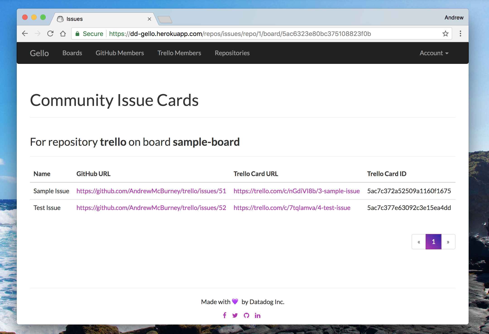

#### Aggregating Community Pull Requests

Likewise, to see open community pull requests on a repository aggregated by a Trello board, click on a link under the "Pull Requests" column in the subscriptions table:

### GitHub Webhooks
_Gello_ uses [GitHub webhooks](https://developer.github.com/webhooks/) to get event updates from the organizations and repositories subscribed.

When a subscription is made, _Gello_ will create a GitHub repo webhook on the corresponding repository with the following permissions: `Issues`, `Issue comments`, `Pull requests`, and `Pull request review comments`. This will allow the server to receive webhook events whenever an issue or pull request is created, commented upon, or labeled. They are necessary for both the _autocard_ and _manual_ settings.

_Gello_ will also create a GitHub organization webhook on the corresponding organization with the `organization` event. This will allow the server to receive webhook events whenever a member is added or removed from the subscribed organization.

### GitHub Events
#### Pull Request Event

For the _autocard_ setting, if a pull request is created by a person outside of the members of a GitHub organization on a subscribing repository, a Trello card or JIRA issue will be added to the respective Trello board lists or JIRA project, configurable in the _Gello_ web-UI.

#### Issue Event

Likewise, for the _autocard_ setting, if an issue is created by a person outside of the members of a GitHub organization on a subscribed repository, a Trello card or JIRA issue will be added to the respective Trello board lists or JIRA project, configurable in the _Gello_ web-UI.

#### Pull Request Comment Event

For the _manual_ setting, if a pull request has been created, and a member of the GitHub organization comments `gello create_card` on the pull request, a Trello card or JIRA issue will be added to the respective Trello board lists or JIRA project, configurable in the _Gello_ web-UI.

#### Issue Comment Event

For the _manual_ setting, if an issue has been created, and a member of the GitHub organization comments `gello create_card` on the issue, a Trello card or JIRA issue will be added to the respective Trello board lists or JIRA project, configurable in the _Gello_ web-UI.

